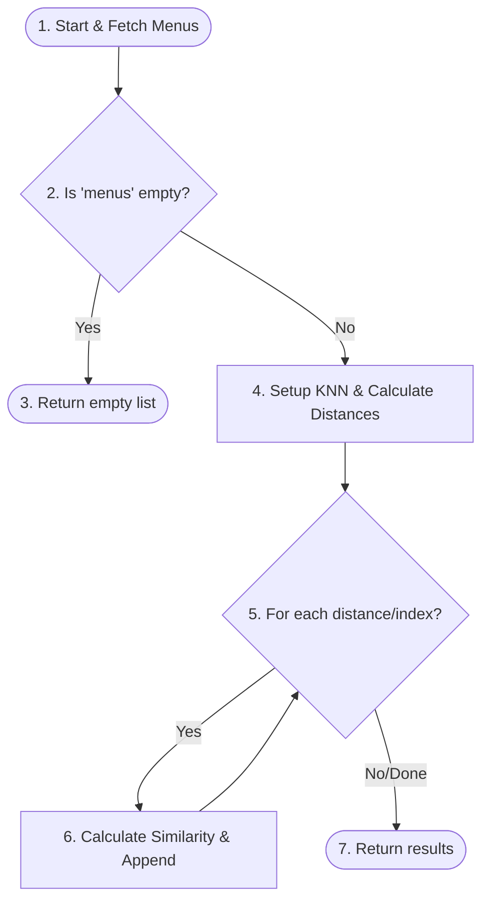
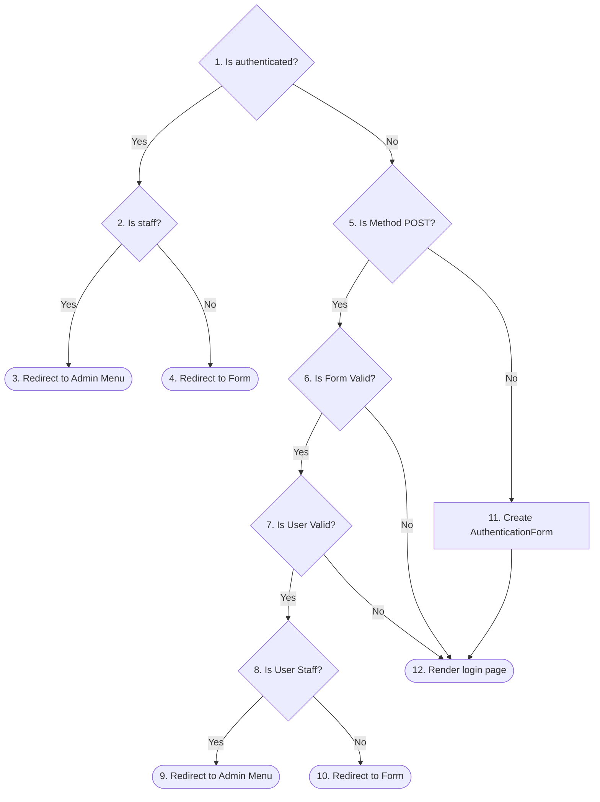

# Laporan Pengujian Sistem (Testing Report)
Laporan ini berisi rincian pengujian Whitebox dan Blackbox pada sistem rekomendasi menu kopi menggunakan algoritma K-Nearest Neighbors (KNN).

---

## 1. Whitebox Testing

Whitebox testing dilakukan dengan menganalisis logika internal dari beberapa fungsi utama sistem untuk mengukur kompleksitas kode dan mengidentifikasi seluruh alur eksekusi (indepedent paths). Metode pengukuran menggunakan **Cyclomatic Complexity (CC)** dengan rumus:
$$V(G) = E - V + 2$$
Atau:
$$V(G) = P + 1$$
Dimana:
- $E$ = Jumlah Edges (arah alur)
- $V$ = Jumlah Nodes (titik proses/kondisi)
- $P$ = Jumlah Decision Nodes (titik percabangan logika)

---

### A. Fungsi `get_recommendations` (`recommendation/services/recommendation_engine.py`)

#### 1. Kode Program
```python
def get_recommendations(user_preferences: dict, k: int = 3):
    from recommendation.models import MenuKopi

    menus = list(MenuKopi.objects.all()) # [Node 1]

    if not menus: # [Node 2 - Decision]
        return [] # [Node 3 - Exit]

    k = min(k, len(menus)) # [Node 4]
    X = np.array([_menu_to_vector(m) for m in menus], dtype=float)
    labels = list(range(len(menus)))
    scaler = MinMaxScaler()
    X_scaled = scaler.fit_transform(X)
    user_vec = np.array([_prefs_to_vector(user_preferences)], dtype=float)
    user_scaled = scaler.transform(user_vec)
    knn = KNeighborsClassifier(n_neighbors=k, metric='euclidean')
    knn.fit(X_scaled, labels)
    distances, indices = knn.kneighbors(user_scaled, n_neighbors=k)
    max_dist = float(np.sqrt(X_scaled.shape[1]))
    results = []

    for dist, idx in zip(distances[0], indices[0]): # [Node 5 - Decision Loop]
        similarity = max(0.0, (1.0 - dist / max_dist)) * 100
        results.append({
            'menu': menus[int(idx)],
            'similarity': round(similarity, 1),
            'distance': round(float(dist), 4),
        }) # [Node 6]

    return results # [Node 7 - Exit]
```

#### 2. Flowgraph (Mermaid)


#### 3. Cyclomatic Complexity
- **Jumlah Node ($V$)**: 7
- **Jumlah Edge ($E$)**: 8
- **Jumlah Decision Point ($P$)**: 2 (Node 2 dan Node 5)
- **Perhitungan**:
  - $V(G) = E - V + 2 = 8 - 7 + 2 = 3$
  - $V(G) = P + 1 = 2 + 1 = 3$

Maka, Kompleksitas Siklomatis untuk fungsi `get_recommendations` adalah **3**.

#### 4. Jalur Independen (Independent Paths)
- **Path 1**: 1 - 2 (Yes) - 3
  - *Kondisi*: Database menu kosong.
- **Path 2**: 1 - 2 (No) - 4 - 5 (No/Done) - 7
  - *Kondisi*: Database menu terisi, tetapi perulangan loop langsung selesai (tidak melakukan iterasi).
- **Path 3**: 1 - 2 (No) - 4 - 5 (Yes) - 6 - 5 - 7
  - *Kondisi*: Database menu terisi dan menghasilkan rekomendasi kopi yang diproses dalam loop.

---

### B. Fungsi `login_view` (`recommendation/views.py`)

#### 1. Kode Program
```python
def login_view(request):
    if request.user.is_authenticated: # [Node 1 - Decision]
        if request.user.is_staff: # [Node 2 - Decision]
            return redirect('recommendation:admin_menu') # [Node 3 - Exit]
        return redirect('recommendation:form') # [Node 4 - Exit]

    if request.method == 'POST': # [Node 5 - Decision]
        form = AuthenticationForm(request, data=request.POST)
        if form.is_valid(): # [Node 6 - Decision]
            email = form.cleaned_data.get('username')
            password = form.cleaned_data.get('password')
            user = authenticate(username=email, password=password)
            if user is not None: # [Node 7 - Decision]
                login(request, user)
                if user.is_staff: # [Node 8 - Decision]
                    return redirect('recommendation:admin_menu') # [Node 9 - Exit]
                return redirect('recommendation:form') # [Node 10 - Exit]
    else:
        form = AuthenticationForm() # [Node 11]

    return render(request, 'recommendation/login.html', {'form': form}) # [Node 12 - Exit]
```

#### 2. Flowgraph (Mermaid)


#### 3. Cyclomatic Complexity
- **Jumlah Node ($V$)**: 12
- **Jumlah Edge ($E$)**: 17
- **Jumlah Decision Point ($P$)**: 6 (Node 1, 2, 5, 6, 7, 8)
- **Perhitungan**:
  - $V(G) = E - V + 2 = 17 - 12 + 2 = 7$
  - $V(G) = P + 1 = 6 + 1 = 7$

Maka, Kompleksitas Siklomatis untuk fungsi `login_view` adalah **7**.

#### 4. Jalur Independen (Independent Paths)
- **Path 1**: 1 (Yes) - 2 (Yes) - 3
- **Path 2**: 1 (Yes) - 2 (No) - 4
- **Path 3**: 1 (No) - 5 (No) - 11 - 12
- **Path 4**: 1 (No) - 5 (Yes) - 6 (No) - 12
- **Path 5**: 1 (No) - 5 (Yes) - 6 (Yes) - 7 (No) - 12
- **Path 6**: 1 (No) - 5 (Yes) - 6 (Yes) - 7 (Yes) - 8 (Yes) - 9
- **Path 7**: 1 (No) - 5 (Yes) - 6 (Yes) - 7 (Yes) - 8 (No) - 10

---

## 2. Blackbox Testing

Blackbox testing dilakukan untuk menguji fungsionalitas sistem berdasarkan masukan (input) dan keluaran (output) tanpa melihat detail kode program.

| No | Script Test - Procedure Test | Expected Result | Test Result | Test Explain |
| :--- | :--- | :--- | :--- | :--- |
| **1** | Mendaftarkan pengguna baru dengan email dan password yang valid. | Pengguna berhasil didaftarkan dan diarahkan ke halaman pengisian kuesioner rekomendasi kopi. | **Berhasil** | Akun pengguna dibuat di database dan sistem melakukan login otomatis setelah registrasi sukses. |
| **2** | Mendaftarkan pengguna baru menggunakan email yang sudah terdaftar. | Sistem menampilkan pesan kesalahan bahwa email sudah digunakan. | **Berhasil** | Validasi form menolak pendaftaran dan meminta email yang unik. |
| **3** | Melakukan login menggunakan akun pengguna (bukan admin) dengan email dan password yang valid. | Sistem berhasil melakukan autentikasi dan mengarahkan ke halaman form rekomendasi kopi. | **Berhasil** | Sesi pengguna berhasil dibuat dan halaman form preferensi terbuka. |
| **4** | Melakukan login menggunakan akun Administrator (staff) dengan email dan password yang valid. | Sistem berhasil melakukan autentikasi dan mengarahkan ke dashboard manajemen menu kopi (Admin). | **Berhasil** | Pengguna staff secara otomatis diarahkan ke menu manajemen menu. |
| **5** | Melakukan login dengan email atau password yang salah. | Sistem menolak autentikasi dan menampilkan pesan kesalahan "Username dan password salah". | **Berhasil** | Form kembali ditampilkan beserta pesan galat (error message). |
| **6** | Mengirimkan form preferensi rekomendasi kopi dengan nilai valid pada setiap parameter rasa (kemanisan, kepahitan, keasaman, body, aroma, dll). | Sistem menghitung kemiripan menggunakan KNN dan mengarahkan pengguna ke halaman hasil dengan daftar 3 menu teratas. | **Berhasil** | Data preferensi tersimpan, perhitungan KNN berjalan, dan menu rekomendasi tampil dengan nilai persentase kecocokan. |
| **7** | Mengirimkan form preferensi ketika belum ada satu pun menu kopi yang terdaftar di database. | Sistem menampilkan pesan error "Belum ada data menu kopi." | **Berhasil** | Penanganan kondisi database kosong bekerja dengan baik sehingga menghindari error program. |
| **8** | Menambahkan menu kopi baru melalui modul admin dengan melengkapi seluruh atribut (nama, kemanisan, kepahitan, keasaman, body, dll). | Menu kopi baru tersimpan di database dan muncul pada daftar menu kopi di panel admin. | **Berhasil** | Operasi Create (C) berhasil dan data tersimpan dengan format yang benar. |
| **9** | Mengubah informasi menu kopi yang sudah ada melalui modul admin. | Perubahan data menu tersimpan ke database dan daftar menu diperbarui sesuai dengan perubahan. | **Berhasil** | Operasi Update (U) berhasil diperbarui tanpa mengganti ID menu. |
| **10** | Menghapus menu kopi dari daftar menu kopi melalui modul admin. | Menu kopi terhapus dari database dan tidak lagi ditampilkan di daftar menu kopi. | **Berhasil** | Operasi Delete (D) berhasil menghapus relasi menu kopi tersebut. |
| **11** | Menghapus akun pengguna lain melalui panel admin manajemen pengguna. | Pengguna yang dipilih berhasil dihapus dari sistem. | **Berhasil** | Akun terhapus dari database dan tidak dapat digunakan untuk login kembali. |
| **12** | Menghapus akun admin itu sendiri yang sedang aktif melakukan login. | Sistem menolak penghapusan dan memunculkan pesan peringatan "Anda tidak dapat menghapus akun Anda sendiri." | **Berhasil** | Proteksi keamanan mencegah administrator tidak sengaja mengunci diri sendiri dari sistem. |
| **13** | Melakukan logout dari sistem. | Sesi (session) berakhir dan pengguna diarahkan kembali ke halaman login. | **Berhasil** | Pengguna tidak dapat lagi mengakses halaman form preferensi tanpa login kembali. |
